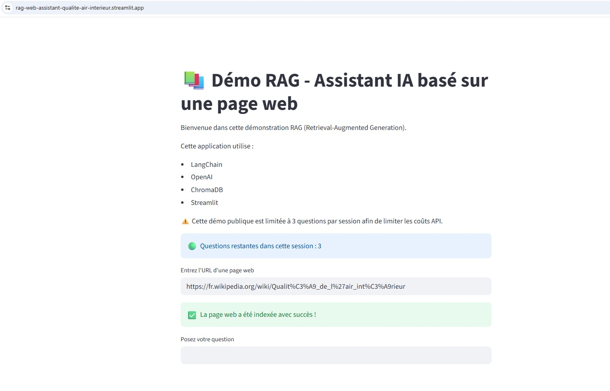

# 📚 Assistant IA RAG – Questions/Réponses basées sur une page web

---

# 👤 Auteur
Projet réalisé par Thuy Duong PHAM

---

Ce projet est une application de Retrieval-Augmented Generation (RAG) développée avec Streamlit, LangChain, OpenAI et ChromaDB.

L’application permet à un utilisateur :
- d’entrer l’URL d’une page web,
- d’extraire automatiquement son contenu,
- d’indexer les informations dans une base vectorielle,
- de poser des questions en langage naturel sur cette page,
- d’obtenir des réponses générées par un modèle de langage et basées uniquement sur le contenu de la page.

Ce projet illustre la mise en œuvre concrète :
- d’un pipeline RAG,
- d’une base vectorielle,
- d’embeddings,
- de découpage de documents,
- d’orchestration LLM avec LangChain,
- de déploiement d’une application IA avec Streamlit Cloud.

---

# 🚀 Démonstration en ligne

👉 [Accéder à l’application Streamlit](https://rag-web-assistant-qualite-air-interieur.streamlit.app/)

---

# 📸 Aperçu de l’application



---

# 🛠️ Technologies utilisées

- Python
- Streamlit
- LangChain
- OpenAI API
- ChromaDB
- BeautifulSoup
- Vector Embeddings
- Retrieval-Augmented Generation (RAG)

---

# 📂 Structure du projet

```bash
.
├── app.py
├── rag_pipeline.py
├── requirements.txt
├── .gitignore
├── README.md
└── screenshot.jpg
```

---

# ⚙️ Fonctionnalités

## Extraction de contenu web
- Chargement automatique d’une page web à partir d’une URL
- Extraction du contenu textuel

## Découpage intelligent des documents
- Segmentation du texte en chunks
- Gestion du chevauchement pour améliorer la recherche sémantique

## Base vectorielle
- Génération d’embeddings OpenAI
- Stockage dans ChromaDB

## Pipeline RAG
- Recherche des passages les plus pertinents
- Injection du contexte dans le prompt
- Réponses contextualisées basées sur les documents

## Interface utilisateur
- Interface web interactive avec Streamlit
- Déploiement cloud
- Limitation du nombre de questions par session pour maîtriser les coûts API

---

# 🧠 Architecture du pipeline RAG

Le fonctionnement de l’application suit les étapes suivantes :

1. Chargement de la page web
2. Extraction du contenu
3. Découpage en chunks
4. Génération des embeddings
5. Stockage dans ChromaDB
6. Recherche des passages pertinents
7. Construction du prompt enrichi
8. Génération de la réponse par le LLM

---

# ☁️ Déploiement

L’application est déployée avec Streamlit Community Cloud.

---

# 📌 Cas d’usage

- Recherche sémantique dans une page web
- Assistant IA basé sur une documentation
- Exploration intelligente de contenu web
- Démonstration pédagogique d’un pipeline RAG
- Prototype d’assistant documentaire

---

# 📈 Compétences mises en œuvre

Ce projet démontre des compétences en :

- Intelligence artificielle générative
- Retrieval-Augmented Generation (RAG)
- LangChain
- Prompt engineering
- Vector databases
- API OpenAI
- Développement Python
- Déploiement cloud
- Gestion des dépendances Python

---

# 🔒 Contrôle des coûts API

La démonstration publique limite volontairement le nombre de questions par session afin de maîtriser les coûts d’utilisation de l’API OpenAI.


---

# 📄 Licence

Projet réalisé à des fins pédagogiques et de démonstration technique.
